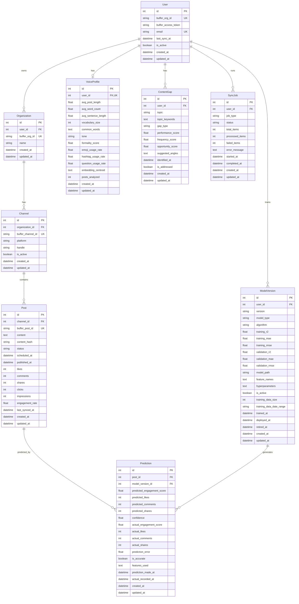

# BufferIQ Data Model Documentation

Complete specification of BufferIQ's database schema, relationships, and design decisions.

## Entity Relationship Diagram

## Table Specifications

### User

**Purpose**: Represents a BufferIQ user who has connected their Buffer account.

**Fields**:
- `id` (PK): Auto-incrementing primary key
- `buffer_org_id` (Unique): Buffer organization identifier
- `buffer_access_token`: Encrypted OAuth token for Buffer API
- `email` (Unique, Optional): User's email address
- `last_sync_at` (Optional): Last successful data sync timestamp
- `is_active`: Account active status (default: true)
- `created_at`: Record creation timestamp
- `updated_at`: Last modification timestamp

**Indexes**:
- Primary key on `id`
- Unique index on `buffer_org_id`
- Unique index on `email`

**Relationships**:
- One-to-many with Organization
- One-to-one with VoiceProfile
- One-to-many with ModelVersion
- One-to-many with ContentGap
- One-to-many with SyncJob

**Cascade Behavior**:
- Deleting a User deletes all related Organizations, VoiceProfile, ModelVersions, ContentGaps, and SyncJobs

---

### Organization

**Purpose**: Represents a Buffer organization containing social media channels.

**Fields**:
- `id` (PK): Auto-incrementing primary key
- `user_id` (FK): Reference to User table
- `buffer_org_id` (Unique): Buffer organization identifier
- `name`: Organization name
- `created_at`: Record creation timestamp
- `updated_at`: Last modification timestamp

**Indexes**:
- Primary key on `id`
- Foreign key index on `user_id`
- Unique index on `buffer_org_id`
- Composite index on (`user_id`, `buffer_org_id`)

**Relationships**:
- Many-to-one with User
- One-to-many with Channel

**Cascade Behavior**:
- Deleting an Organization deletes all related Channels

---

### Channel

**Purpose**: Represents a social media account connected to Buffer.

**Fields**:
- `id` (PK): Auto-incrementing primary key
- `organization_id` (FK): Reference to Organization table
- `buffer_channel_id` (Unique): Buffer channel identifier
- `platform`: Social platform (linkedin, twitter, facebook, instagram)
- `handle`: Social media handle/username
- `is_active`: Channel active status (default: true)
- `created_at`: Record creation timestamp
- `updated_at`: Last modification timestamp

**Indexes**:
- Primary key on `id`
- Foreign key index on `organization_id`
- Unique index on `buffer_channel_id`
- Index on `platform`
- Composite index on (`platform`, `is_active`)

**Constraints**:
- `platform` must be one of: 'linkedin', 'twitter', 'facebook', 'instagram'

**Relationships**:
- Many-to-one with Organization
- One-to-many with Post

**Cascade Behavior**:
- Deleting a Channel deletes all related Posts

---

### Post

**Purpose**: Represents a social media post scheduled or published through Buffer.

**Fields**:
- `id` (PK): Auto-incrementing primary key
- `channel_id` (FK): Reference to Channel table
- `buffer_post_id` (Unique): Buffer post identifier
- `content`: Post text content
- `content_hash`: Hash for deduplication
- `status`: Post status (draft, scheduled, sent, failed)
- `scheduled_at` (Optional): Scheduled publication time
- `published_at` (Optional): Actual publication time
- `likes` (Optional): Number of likes
- `comments` (Optional): Number of comments
- `shares` (Optional): Number of shares
- `clicks` (Optional): Number of clicks
- `impressions` (Optional): Number of impressions
- `engagement_rate` (Optional): Calculated engagement rate (0-1)
- `last_synced_at` (Optional): Last sync with Buffer
- `created_at`: Record creation timestamp
- `updated_at`: Last modification timestamp

**Indexes**:
- Primary key on `id`
- Foreign key index on `channel_id`
- Unique index on `buffer_post_id`
- Index on `content_hash`
- Index on `status`
- Index on `scheduled_at`
- Index on `published_at`
- Composite index on (`channel_id`, `status`)
- Composite index on (`channel_id`, `published_at`)
- Composite index on (`scheduled_at`, `status`)

**Constraints**:
- `status` must be one of: 'draft', 'scheduled', 'sent', 'failed'
- `likes`, `comments`, `shares`, `clicks`, `impressions` must be >= 0
- `engagement_rate` must be between 0 and 1

**Computed Properties**:
- `total_engagement`: Sum of likes + comments + shares

**Relationships**:
- Many-to-one with Channel
- One-to-many with Prediction

**Cascade Behavior**:
- Deleting a Post deletes all related Predictions

---

### Prediction

**Purpose**: Stores ML predictions for post engagement with actual results.

**Fields**:
- `id` (PK): Auto-incrementing primary key
- `post_id` (FK): Reference to Post table
- `model_version_id` (FK): Reference to ModelVersion table
- `predicted_engagement_score`: Predicted normalized score
- `predicted_likes` (Optional): Predicted likes count
- `predicted_comments` (Optional): Predicted comments count
- `predicted_shares` (Optional): Predicted shares count
- `confidence`: Model confidence (0-1)
- `actual_engagement_score` (Optional): Actual normalized score
- `actual_likes` (Optional): Actual likes count
- `actual_comments` (Optional): Actual comments count
- `actual_shares` (Optional): Actual shares count
- `prediction_error` (Optional): Difference between predicted and actual
- `is_accurate` (Optional): Whether prediction was within threshold
- `features_used`: JSON string of features
- `prediction_made_at`: When prediction was generated
- `actual_recorded_at` (Optional): When actuals were recorded
- `created_at`: Record creation timestamp
- `updated_at`: Last modification timestamp

**Indexes**:
- Primary key on `id`
- Foreign key index on `post_id`
- Foreign key index on `model_version_id`
- Index on `prediction_made_at`
- Composite index on (`post_id`, `model_version_id`)

**Constraints**:
- `confidence` must be between 0 and 1
- `predicted_likes`, `predicted_comments`, `predicted_shares` must be >= 0

**Relationships**:
- Many-to-one with Post
- Many-to-one with ModelVersion

---

### ModelVersion

**Purpose**: Tracks ML model versions with performance metrics.

**Fields**:
- `id` (PK): Auto-incrementing primary key
- `user_id` (FK): Reference to User table
- `version`: Semantic version (e.g., "1.0.0")
- `model_type`: Model category (e.g., "engagement_predictor")
- `algorithm`: Algorithm used (e.g., "xgboost", "lightgbm")
- `training_r2`: R² score on training set
- `training_mae`: Mean Absolute Error on training set
- `training_rmse`: Root Mean Squared Error on training set
- `validation_r2`: R² score on validation set
- `validation_mae`: Mean Absolute Error on validation set
- `validation_rmse`: Root Mean Squared Error on validation set
- `model_path`: File path to serialized model
- `feature_names`: JSON array of feature names
- `hyperparameters`: JSON object of hyperparameters
- `is_active`: Whether model is currently active
- `training_data_size`: Number of training samples
- `training_data_date_range`: Date range of training data
- `trained_at`: When model was trained
- `deployed_at` (Optional): When model was deployed
- `retired_at` (Optional): When model was retired
- `created_at`: Record creation timestamp
- `updated_at`: Last modification timestamp

**Indexes**:
- Primary key on `id`
- Foreign key index on `user_id`
- Index on `version`
- Composite index on (`user_id`, `version`)
- Composite index on (`is_active`, `user_id`)

**Constraints**:
- `training_data_size` must be > 0

**Relationships**:
- Many-to-one with User
- One-to-many with Prediction

---

### VoiceProfile

**Purpose**: Captures user's writing style and linguistic patterns.

**Fields**:
- `id` (PK): Auto-incrementing primary key
- `user_id` (FK, Unique): Reference to User table
- `avg_post_length`: Average character count
- `avg_word_count`: Average word count
- `avg_sentence_length`: Average sentence length
- `vocabulary_size`: Unique words used
- `common_words`: JSON array of frequently used words
- `tone`: Writing tone (e.g., "professional", "casual")
- `formality_score`: Formality rating (0-1)
- `emoji_usage_rate`: Frequency of emoji use (0-1)
- `hashtag_usage_rate`: Frequency of hashtag use (0-1)
- `question_usage_rate`: Frequency of questions (0-1)
- `embedding_centroid`: JSON array of semantic embedding
- `posts_analyzed`: Number of posts analyzed
- `created_at`: Record creation timestamp
- `updated_at`: Last modification timestamp

**Indexes**:
- Primary key on `id`
- Unique foreign key index on `user_id`

**Constraints**:
- `avg_post_length`, `avg_word_count`, `vocabulary_size` must be >= 0
- `formality_score`, `emoji_usage_rate`, `hashtag_usage_rate`, `question_usage_rate` must be between 0 and 1
- `posts_analyzed` must be > 0

**Relationships**:
- One-to-one with User

---

### ContentGap

**Purpose**: Identifies content opportunities based on performance and frequency.

**Fields**:
- `id` (PK): Auto-incrementing primary key
- `user_id` (FK): Reference to User table
- `topic`: Topic name
- `topic_keywords`: JSON array of keywords
- `gap_type`: Type of gap (underused_high_performer, declining, emerging)
- `performance_score`: Topic performance rating (0-1)
- `frequency_score`: Topic frequency rating (0-1)
- `opportunity_score`: Calculated opportunity score (0-1)
- `suggested_angles`: JSON array of content angle suggestions
- `identified_at`: When gap was identified
- `is_addressed`: Whether gap has been addressed
- `created_at`: Record creation timestamp
- `updated_at`: Last modification timestamp

**Indexes**:
- Primary key on `id`
- Foreign key index on `user_id`
- Index on `topic`
- Composite index on (`user_id`, `opportunity_score`)

**Constraints**:
- `gap_type` must be one of: 'underused_high_performer', 'declining', 'emerging'
- `performance_score`, `frequency_score`, `opportunity_score` must be between 0 and 1

**Relationships**:
- Many-to-one with User

---

### SyncJob

**Purpose**: Tracks data synchronization operations with Buffer API.

**Fields**:
- `id` (PK): Auto-incrementing primary key
- `user_id` (FK): Reference to User table
- `job_type`: Type of sync (initial, incremental)
- `status`: Job status (pending, running, completed, failed)
- `total_items` (Optional): Total items to process
- `processed_items`: Items processed successfully
- `failed_items`: Items that failed
- `error_message` (Optional): Error details
- `started_at`: Job start time
- `completed_at` (Optional): Job completion time
- `created_at`: Record creation timestamp
- `updated_at`: Last modification timestamp

**Indexes**:
- Primary key on `id`
- Foreign key index on `user_id`
- Index on `status`
- Composite index on (`user_id`, `status`)

**Constraints**:
- `job_type` must be one of: 'initial', 'incremental'
- `status` must be one of: 'pending', 'running', 'completed', 'failed'
- `processed_items`, `failed_items` must be >= 0

**Computed Properties**:
- `success_rate`: (processed - failed) / processed

**Relationships**:
- Many-to-one with User

---

## Design Decisions

### Normalization
- Database is in 3NF (Third Normal Form)
- No redundant data except for performance optimization (e.g., `engagement_rate`)
- Computed values stored only when expensive to calculate

### Cascade Deletes
- All foreign keys use `ON DELETE CASCADE` except where preservation is required
- Ensures referential integrity
- Simplifies cleanup operations

### Indexing Strategy
- Primary keys: Auto-incrementing integers
- Foreign keys: Always indexed
- Unique constraints: External IDs (Buffer IDs)
- Composite indexes: Multi-column queries

### Timestamps
- All tables have `created_at` and `updated_at`
- Server-side defaults using `func.now()`
- Automatic updates on modification

### JSON Storage
- Used for flexible/evolving data structures
- Feature vectors, hyperparameters, keywords
- Validated at application layer

### Validation
- Database constraints for data integrity
- Application validators for business logic
- Both layers work together for robustness

---
